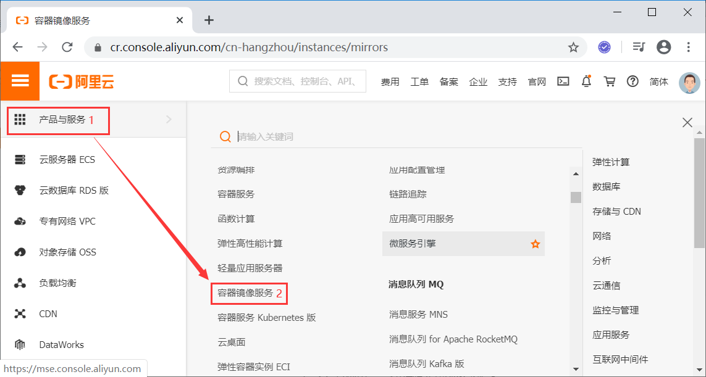

# Tip：

笔记是根据B站秦疆老师直播课程写的，有想需要的小伙伴可以看视频。

**传送门：https://www.bilibili.com/video/BV1og4y1q7M4**

# 1.Docker安装

## 1.1.安装Docker

>环境查看

```shell
# 系统内核是3.10以上的
[root@centos-7-test1 ~]# uname -r
3.10.0-1127.el7.x86_64
```

```	shell
# 系统版本
[root@centos-7-test1 ~]# cat /etc/os-release 
NAME="CentOS Linux"
VERSION="7 (Core)"
ID="centos"
ID_LIKE="rhel fedora"
VERSION_ID="7"
PRETTY_NAME="CentOS Linux 7 (Core)"
ANSI_COLOR="0;31"
CPE_NAME="cpe:/o:centos:centos:7"
HOME_URL="https://www.centos.org/"
BUG_REPORT_URL="https://bugs.centos.org/"

CENTOS_MANTISBT_PROJECT="CentOS-7"
CENTOS_MANTISBT_PROJECT_VERSION="7"
REDHAT_SUPPORT_PRODUCT="centos"
REDHAT_SUPPORT_PRODUCT_VERSION="7"
```

>安装Docker

帮助文档：https://docs.docker.com/engine/install/centos/

```shell
# 1、卸载旧的Docker版本
sudo yum remove docker \
                  docker-client \
                  docker-client-latest \
                  docker-common \
                  docker-latest \
                  docker-latest-logrotate \
                  docker-logrotate \
                  docker-engine
# 2、需要的安装包
sudo yum install -y yum-utils

#3、设置镜像的仓库
sudo yum-config-manager \
    --add-repo \
    https://download.docker.com/linux/centos/docker-ce.repo # 默认是国外的下载超级慢！

sudo yum-config-manager \
    --add-repo \   
    http://mirrors.aliyun.com/docker-ce/linux/centos/docker-ce.repo # 阿里云的镜像

# 更新yum软件包索引
yum makecache fast

# 4、安装docker相关的软件 docker-ce社区版 docker-ee企业版
sudo yum install docker-ce docker-ce-cli containerd.io

# 5、启动docker
sudo systemctl start docker

# 6、测试docker安装成功？
docker version

# 7、永远的 [HelloWorld] ^_^ 能够成功拉取image表示docker安装成功！
docker run hello-world
```

```shell
# docker踩到的坑:运行[docker run hello-world]遇到的坑？会报错？
docker: Error response from daemon: Get https://registry-1.docker.io/v2/library/hello-world/manifests/latest: Get https://auth.docker.io/token?scope=repository%3Alibrary%2Fhello-world%3Apull&service=registry.docker.io: net/http: TLS handshake timeout.

# 解决办法：在/etc/docker下创建daemon.json文件。拷贝如下代码:
{
  "registry-mirrors":["https://registry.docker-cn.com","http://hub-mirror.c.163.com"]
}
# 保存退出！
# 重启docker服务：service docker restart
```

> 卸载Docker

```shell
# 1、卸载依赖
sudo yum remove docker-ce docker-ce-cli containerd.io

# 2、删除资源
sudo rm -rf /var/lib/docker

# /var/lib/docker是Docker默认的工作路径！！！
```

## 1.2.阿里云镜像加速

> 设置阿里云镜像步骤

1、登录 [阿里云--->控制台] 找到容器服务。



2、找到镜像加速地址。


3、配置加速器使用

```shell
sudo mkdir -p /etc/docker

sudo tee /etc/docker/daemon.json <<-'EOF'
{
  "registry-mirrors": ["https://phapqiqc.mirror.aliyuncs.com"]
}
EOF

sudo systemctl daemon-reload

sudo systemctl restart docker
```


> docker run 的运行流程图


## 1.3.底层原理

> docker是怎么工作的？

Docker是一个Client-Server结构的系统，Docker的守护进程运行在主机上，通过Socket从客户端访问。

Docker-Server接收到Docker-Client的指令，就会执行这个命令。


>docker为什么比VM快？

1、Docker有着比虚拟机更少的抽象层。

2、Docker利用的是宿主机的内核。所以说新建一个容器的时候，docker不需要像虚拟机一样重新加载个操作系统内核。


# 2.Docker的常用命令

## 2.1.帮助命令

```shell
docker version	#显示docker的版本信息
docker info		#显示Docker的系统信息，包括镜像和容器的数量
docker [命令] --help	#docker帮助信息
```

Docker帮助文档地址：https://docs.docker.com/reference/


## 2.2.镜像命令

> docker images  查看所有本地的主机上的镜像

```shell
[root@centos-7-test1 ~]# docker images
REPOSITORY          TAG                 IMAGE ID            CREATED             SIZE
hello-world         latest              bf756fb1ae65        5 months ago        13.3kB

#解释
REPOSITORY	镜像的仓库源
TAG			镜像的标签
IMAGE ID	镜像的ID
CREATED		镜像的创建时间
SIZE		镜像的大小

#可选项
  -a, --all             #列出所有的镜像
  -q, --quiet           #只显示镜像的id
```

> docker search   去dockerhub搜索镜像

```shell
[root@centos-7-test1 ~]# docker search mysql

#可选项
--filter=stars=3000	#搜索出来的镜像就是stars大于3000的
[root@centos-7-test1 ~]# docker search nginx --filter=stars=3000
NAME                DESCRIPTION                STARS               OFFICIAL            AUTOMATED
nginx               Official build of Nginx.   13323               [OK] 
```

> docker poll	下载镜像

```shell
# 下载镜像 docker pull [镜像名] [:tag]
[root@centos-7-test1 ~]# docker pull mysql
Using default tag: latest # 如果不写tag，默认就下载lastest最新版本
latest: Pulling from library/mysql
8559a31e96f4: Pull complete # 分层下载，docker image的核心，联合文件系统
d51ce1c2e575: Pull complete 
c2344adc4858: Pull complete 
fcf3ceff18fc: Pull complete 
16da0c38dc5b: Pull complete 
b905d1797e97: Pull complete 
4b50d1c6b05c: Pull complete 
c75914a65ca2: Pull complete 
1ae8042bdd09: Pull complete 
453ac13c00a3: Pull complete 
9e680cd72f08: Pull complete 
a6b5dc864b6c: Pull complete 
Digest: sha256:8b7b328a7ff6de46ef96bcf83af048cb00a1c86282bfca0cb119c84568b4caf6 # 签名(防伪标志)
Status: Downloaded newer image for mysql:latest
docker.io/library/mysql:latest # 真实地址

#等价于
docker pull mysql
docker pull docker.io/library/mysql:latest

#指定版本下载 
[root@centos-7-test1 ~]# docker pull mysql:5.7
5.7: Pulling from library/mysql
8559a31e96f4: Already exists # 下载的mysql5.7和之前下载的mysql可以部分文件可以共用
d51ce1c2e575: Already exists 
c2344adc4858: Already exists 
fcf3ceff18fc: Already exists 
16da0c38dc5b: Already exists 
b905d1797e97: Already exists 
4b50d1c6b05c: Already exists 
d85174a87144: Pull complete 
a4ad33703fa8: Pull complete 
f7a5433ce20d: Pull complete 
3dcd2a278b4a: Pull complete 
Digest: sha256:32f9d9a069f7a735e28fd44ea944d53c61f990ba71460c5c183e610854ca4854
Status: Downloaded newer image for mysql:5.7
docker.io/library/mysql:5.7
```

> docker rmi	删除image

```shell
# 根据image ID删除指定的image
[root@centos-7-test1 ~]# docker rmi -f 9cfcce23593a
Untagged: mysql:5.7
Untagged: mysql@sha256:32f9d9a069f7a735e28fd44ea944d53c61f990ba71460c5c183e610854ca4854
Deleted: sha256:9cfcce23593a93135ca6dbf3ed544d1db9324d4c40b5c0d56958165bfaa2d46a
Deleted: sha256:98de3e212919056def8c639045293658f6e6022794807d4b0126945ddc8324be
Deleted: sha256:17e8b88858e400f8c5e10e7cb3fbab9477f6d8aacba03b8167d34a91dbe4d8c1
Deleted: sha256:c04c087c2af9abd64ba32fe89d65e6d83da514758923de5da154541cc01a3a1e
Deleted: sha256:ab8bf065b402b99aec4f12c648535ef1b8dc954b4e1773bdffa10ae2027d3e00

# 递归删除所有image
[root@centos-7-test1 ~]# docker rmi -f $(docker images -aq)

#删除多个image
docker rmi -f [image id1] [image id2]....
```

## 2.3.容器命令

**说明：我们有了image才可以创建容器，下载一个centos镜像来测试和学习。**

> docker run	新建容器并启动

```shell
# docker run [可选参数] image

# 参数说明
--name="Name"   # 给容器取名字
-d				# 后台运行容器并且输出容器的id
-it				# 使用交互方式运行，进入容器查看内容
-p				# (小写的p)容器的端口和Linux主机端口的映射 
	-p 主机端口:容器端口(常用)
	-p ip:主机端口:容器端口
	
-P				# (大写的P)随机指定端口

# 测试，启动centos image并进入容器
[root@centos-7-test1 ~]# docker run -it --name="centos-test1" 470671670cac /bin/bash
[root@91f0881f5e49 /]# ls 
bin  dev  etc  home  lib  lib64  lost+found  media  mnt  opt  proc  root  run  sbin  srv  sys  tmp  usr

# 退出容器命令
[root@91f0881f5e49 /]# exit
exit
[root@centos-7-test1 /]# ls
bin  boot  dev  etc  home  lib  lib64  media  mnt  opt  proc  root  run  sbin  srv  sys  tmp  usr  var
```

> docker ps	列出所有的容器

```shell
# 列出所有正在运行的容器
docker ps [可选参数]

# 可选参数
-a	# 列出所有的容器(包括历史运行的容器)
-n	# 显示n个最后创建的容器
-q 	# 只显示容器的id

# 显示最后一个创建的容器
[root@centos-7-test1 /]# docker ps -n=1
CONTAINER ID        IMAGE               COMMAND             CREATED             STATUS                     PORTS               NAMES
91f0881f5e49        470671670cac        "/bin/bash"         11 minutes ago      Exited (0) 8 minutes ago                       centos-test1

# 列出所有的容器(包括历史运行的容器)
docker ps -a
```

> 退出容器

```shell
exit	# 直接退出容器并退出
ctrl + P + Q 	# 容器不停止退出
```

> docker rm	删除容器

```shell
# 按照容器id删除容器 不能删除正在运行的容器，如果要强制删除，需要使用 rm -f
docker rm [容器id]

# 删除所有容器
docker rm -f $(docker ps -aq)

docker ps -aq | xargs docker rm		# 删除所有的容器
```

> 启动和停止容器的操作

```shell
docker start [容器id]		# 启动容器
docker restart [容器id]	# 重新启动容器
docker stop [容器id] 		# 停止当前正在运行的容器
docker kill [容器id]		# 强制停止运行容器
```

## 2.4.其他常用命令

> 后台启动容器

```shell
# docker run -d [image]

# 问题：docker ps 之后，返现容器停止运行了？why？

# 常见的坑，docker 容器使用后台运行，就必须要有一个前台的进程，docker发现没有应用，就会自动停止。
```

> 查看日志

```shell
docker logs -f -t --tail [number] [容器id]

# 参数说明
-f	# 跟踪日志输出
-t	# 显示时间戳
--tail	# 显示最近number条日志
```

> 查看容器中进程信息

```shell
docker top [容器id]

[root@centos-7-test1 ~]# docker top db1f61a0c5c9
UID                 PID                 PPID                C                   STIME               TTY      root                7196                7177                0                   22:33               pts/0   
```

> 查看容器的元数据

```shell
docker inspect [containerId]
```

> 进入当前正在运行的容器

```shell
# 容器通常都是后台运行的，需要进入容器 

# 方式一：docker exec
docker exec -it [containerId] [bashshell]

[root@centos-7-test1 ~]# docker exec -it db1f61a0c5c9 /bin/bash
[root@db1f61a0c5c9 /]# ls
bin  dev  etc  home  lib  lib64  lost+found  media  mnt  opt  proc  root  run  sbin  srv  sys  tmp  usr 

# 方式二：docker attach
docker attach [containerId]

# 问题：docker exec 和 docker attach 的区别？
docker exec		# 进入容器后开启一个新的终端，exit后不会关闭容器(常用)
docker attach 	# 进入容器正在执行的终端，不会启动新的进程，exit后容器会stop。
```

> 从容器内拷贝文件到主机上

```shell
# 命令docker cp
docker cp containerID:容器内路径 目的主机路径


# 测试将centos容器内 /etc/profile 文件拷贝到主机 /opt/ 目录下
[root@centos-7-test1 ~]# docker ps 
CONTAINER ID        IMAGE               COMMAND             CREATED             STATUS              PORTS    db1f61a0c5c9        470671670cac        "/bin/bash"         25 minutes ago      Up 2 minutes                            
[root@centos-7-test1 ~]# docker cp db1f61a0c5c9:/etc/profile /opt/
[root@centos-7-test1 ~]# cd /opt/
[root@centos-7-test1 opt]# ll
total 4
drwxr-xr-x. 3 root root   72 Jun 11 14:53 activemq
drwx--x--x. 4 root root   28 Jun 12 16:01 containerd
drwxr-xr-x. 3 root root   60 Jun 11 10:20 java
-rw-r--r--. 1 root root 2078 Sep 10  2018 profile
drwxr-xr-x. 2 root root    6 Oct 31  2018 rh
drwxr-xr-x. 3 root root   61 Jun 11 10:23 zookeeper
```

## 2.5.小结

```shell
attach	Attach to a running container            		# 当前shell下进入到指定的正在运行的container中
build 	Build an image from a Dockerfile           		# 通过Dockerfile构建镜像
commit	Create a new image from a container‘s changes		# 提交当前容器为新的镜像
cp   	Copy files/folders between a container and the local filesystem		# 从容器中拷贝文件到宿主机指定路径
create	Create a new container							# 创建一个新的容器,同run，但是不会启动容器
diff	Inspect changes to file on container 			# 查看容器文件的变化
events 	Get real time events from the server			# 从docker服务获取容器实时事件
exec	Run a command in a running container			# 在一个已经运行的容器内执行命令
export	Export a container’s filesystem as a tar archive	# 导出容器的内容流作为一个tar归档文件[对应 import]
history	show the history of an image					# 展示一个镜像形成历史
images	List images										# 列出系统中当前的镜像
import	Import the contents form a tarball to create a filesystem image	# 从tar包中的内容创建一个新的文件系统镜像[对应 export]
info	Display system-wide information					# 展示出系统相关信息
inspect	Return low-level information on a container		# 查看容器详细信息
kill	kill one or more running containers				# 强制停止一个或多个正在运行的容器
load	load an image from a tar archive				# 从一个tar包中加载镜像[对应 save]
login	Registy or login to the docker registry server	# 注册或者登陆一个docker源服务器
logout	Logout from a Docker registy server				# 从当前的docker registry server退出
logs	Fetch the logs of a container					# 显示容器的日志
port	show port mappings for a container				# 查看容器端口的映射
pause	Pause all process within the container			# 暂停容器
ps  	List containers									# 列出当前系统中的容器列表
pull	Pull an image from a registry					# 从docker源服务器中拉取镜像
push	Push an image or repository to a registry 		# 推送指定镜像或镜像库到docker源服务器
restart	Restart one or more containers					# 重启一个或多个容器
stop	Stop one or more running containers				# 停止一个或多个正在运行的容器
tag   	Tag an image into a repository             		# 给源镜像中打标签
top   	Display the running process of a container		# 展示容器中正在运行的进程列表
unpause	Unpause all processes within a container		# 取消暂停容器
version	Show the docker version information     		# 展示Docker版本信息
wait	Block until one or more containers stop,then print their exit codes		# 截取容器停止时的退出状态
```

# 3.Docker镜像

## 3.1.镜像是什么？

镜像是一种轻量级，可执行的独立软件包，用来打包软件运行环境和基于运行环境开发的软件，它包含运行某个软件所需的所有内容，包括代码、运行时、库、环境变量和配置文件。

所有的应用直接打包成为Docker镜像，就可以直接跑起来！

如何得到镜像：

- 从远程仓库下载。
- 朋友拷贝给你。
- 自己制作镜像DockerFile。

## 3.2.Docker镜像加载原理

> UnionFS（联合文件系统）

UnionFS（联合文件系统）：Union文件系统（UnionFS）是一种分层、轻量级并且高性能的文件系统，它支持対文件系统的修改作为一次提交来一层层的叠加，同时可以将不同目录挂载到同一个虚拟文件系统下。Union文件系统是Docker镜像的基础。镜像可以通过分层来继承，基于基础镜像，可以制作各种具体的应用镜像。

特性：一次同时加载多个文件系统，但是从外面看来，只能看到一个文件系统，联合加载会把各层文件叠加起来，这样最终的文件系统会包含所有底层的文件和目录。

> 镜像加载原理

- docker 的镜像实际上由一层一层的文件系统组成，这种层级的文件系统UnionFS。

- bootfs(boot file system) 主要包含bootloader和kernel，bootloader 主要是引导加载kernel，Linux刚启动时会加载bootfs文件系统，在Docker镜像的最底层是bootfs。这一层与我们典型的Linux/Unix系统是一样的，包含boot加载器和内核。当boot加载完成之后整个内核就存在内存中了，此时内存的使用权已由bootfs转交给内核，此时系统也会卸载bootfs。

- roorfs （root file system），在bootfs之上。包含的就是典型Linux系统中的 /dev ，/proc，/bin ，/etx 等标准的目录和文件。rootfs就是各种不同的操作系统发行版。比如Ubuntu，Centos等等。

- 对于一个精简的OS，rootfs可以很小，只需要包括最基本的命令、工具和程序库就可以了，因为底层直接用Host（宿主机）的kernel，自己只需要提供rootfs就行了，由此可见对于不同的Linux发行版，bootfs基本是一致的，rootfs会有差别，因此不同的发行版可以公用bootfs。


> 镜像分层

- 所有的Docker镜像都起始于一个基础的镜像层，当进行修改或增加新的内容时，就会在当前的镜像层上，创建新的镜像层。
- 举一个简单的例子，例如基于CentOS7创建新的镜像，这就是镜像的第一层，如果在该镜像中添加`Java`包，就会在基础镜像层上创建第二个镜像层；如果继续添加一个安全补丁，就会创建第三个镜像层。


## 3.3.Commit镜像

```shell
docker commit 提交容器成为一个新的镜像

# docker commit基本语法
docker commit -m="描述信息" -a="作者名字" 目标镜像ID:[TAG]
```

# 4.容器数据卷

## 4.1.什么是容器数据卷

- 将应用和环境打包成一个镜像！数据？如果数据都在容器中，那么我们将容器删除，数据就会消失。
- 需求：为了解决数据持久化的问题，可以容器数据存储在本地磁盘中，容器之间可以有一个数据共享的技术！
- Docker容器中的数据可以同步到本地，删除容器后数据不会丢失，这就是容器数据卷技术。
- **一句话：容器的数据的持久化和容器间数据的共享。**

## 4.2.使用数据卷

```shell
# -v的基本使用
docker run -d -p 主机端口:容器内端口 -v 主机目录:容器目录 镜像id

# 查看容器数据卷的挂载状态
docker inspect 容器id
```

## 4.3.安装MySQL

```shell
docker run --name mysql -d -p 3306:3306 \
-v /root/mysql/data:/var/lib/mysql \
-v /root/mysql/conf:/etc/mysql \
-e MYSQL_ROOT_PASSWORD=333 \
mysql:tag
```

## 4.4.具名挂载和匿名挂载

> 匿名挂载和具名挂载展示

```shell
# 1、匿名挂载
docker run -d -p --name nginx01 \
-v /etc/nginx \
nginx:6.1

# 查看所有的volume情况
docker volume ls

[root@mingyu bin]# docker volume ls
DRIVER              VOLUME NAME
local               6831db4e060f8452a51fc56b52af0605c944bb0ab16c778a96469233794783ea

# 发现VOLUME NAME这里是一串乱码，这就是匿名挂载，我们在-v时只写了容器内的路径，没有写容器外的路径。

# 2、具名挂载(-v 卷名:容器内路径) 注意这里是卷名而不是容器外路径
docker run -d -p 3307:3306 --name mysql-test \
-v mysql-volume:/etc/mysql \
-e MYSQL_ROOT_PASSWORD=333 \
mysql:5.7

# 查看具名挂载卷的位置
[root@mingyu bin]# docker inspect mysql-test
"Mounts": [
{
"Type": "volume",
"Name": "mysql-volume",
"Source": "/var/lib/docker/volumes/mysql-volume/_data",
"Destination": "/etc/mysql",
"Driver": "local",
"Mode": "z",
"RW": true,
"Propagation": ""
},
```

 所有的Docker容器的容器卷，没有指定目录的情况下都是在`/var/lib/docker/volumes/xxx/_data`。

我们通过具名挂载可以方便的找到我们的一个卷，大多数情况在使用的`具名挂载`。

> 如何区分匿名挂载，还是具名挂载，还是指定路径挂载？

- 匿名挂载：`-v 容器内路径`。
- 具名挂载：`-v 卷名:容器内路径`。
- 指定路径挂载：`-v /宿主机路径:容器内路径`。

> 扩展

```shell
# 通过 -v 容器内路径:ro rw改变读写权限
ro readonly	# 只读
rw readwrite	# 可读可写 

# 只要这个设置了容器权限，容器对我们挂载的数据卷内容就有限定了！
docker run -d -p 3307:3306 --name mysql-test \
-v mysql-volume:/etc/mysql:ro \
-e MYSQL_ROOT_PASSWORD=333 \
mysql:5.7

# ro 说明这个路径只能通过宿主机来操作，容器内部是无法操作的！
```

## 4.5.初识Dockefile

Dockerfile就是用来构建docker image的文件！就是命令脚本！

通过这个脚本可以生成镜像，镜像是一层一层的，脚本一个个的命令，每个命令就是一层。

```shell
# 1、创建一个dockerfile文件，名字可以随意

# 文件中的内容	指令(大写)  参数	
FROM centos
VOLUME ["volume01","volume02"]
CMD echo "---end---"
CMD /bin/bash

# 这里每个命令就是镜像的一层

# 2、docker build生成镜像 
[root@mingyu docker-test-volume]# docker build -f /root/docker-test-volume/dockerfile1 -t mingyu/centos:1.0 . # 这里的这个点表示当前路径下！一定要加
Sending build context to Docker daemon  2.048kB
Step 1/4 : FROM centos
latest: Pulling from library/centos
6910e5a164f7: Pull complete 
Digest: sha256:4062bbdd1bb0801b0aa38e0f83dece70fb7a5e9bce223423a68de2d8b784b43b
Status: Downloaded newer image for centos:latest
 ---> 831691599b88
Step 2/4 : VOLUME ["volume01","volume02"]
 ---> Running in 2431f66d812c
Removing intermediate container 2431f66d812c
 ---> d7d82437e882
Step 3/4 : CMD echo "---end---"
 ---> Running in 61e1c1e347f4
Removing intermediate container 61e1c1e347f4
 ---> 9941580f890a
Step 4/4 : CMD /bin/bash
 ---> Running in c6985be4aaed
Removing intermediate container c6985be4aaed
 ---> 8adb23ccb590
Successfully built 8adb23ccb590
Successfully tagged mingyu/centos:1.0

# 3、启动自己写的容器
docker run -it --name mycentos mingyu/centos:1.0 /bin/bash

# 在容器内部可以看到我们自己定义的容器卷
[root@26c568f61497 /]# ls
bin  dev  etc  home  lib  lib64  lost+found  media  mnt  opt  proc  root  run  sbin  srv  sys  tmp  usr  var  volume01	volume02


# 4、查看容器的数据卷的挂载位置
[root@mingyu ~]# docker inspect mycentos
"Mounts": [
{
"Type": "volume",
"Name": "ec18f8b7f9a2284071501133ec17c5094093200e372dcf6c5b2bd13fbf4c9f06",
"Source": "/var/lib/docker/volumes/ec18f8b7f9a2284071501133ec17c5094093200e372dcf6c5b2bd13fbf4c9f06/_data",
"Destination": "volume01",
"Driver": "local",
"Mode": "",
"RW": true,
"Propagation": ""
},
{
"Type": "volume",
"Name": "8adb94c9d27174623e188e48652d932889a7d84c33466ab96d2548ee7f9fea72",
"Source": "/var/lib/docker/volumes/8adb94c9d27174623e188e48652d932889a7d84c33466ab96d2548ee7f9fea72/_data",
"Destination": "volume02",
"Driver": "local",
"Mode": "",
"RW": true,
"Propagation": ""
}
],
```

这种方式我们未来使用的十分多，因为我们通常会自己构建自己的镜像！

建设构建镜像时没有挂载卷，需要手动挂载` -v 卷名:容器内路径`。

## 4.6.数据卷容器

```shell
# mycentos01容器继承mycentos的容器数据卷
# mycentos01容器也有mycentos的数据了！
docker run -it --name mycentos01 --volumes-from mycentos mingyu/centos:1.0 /bin/bash

# 测试删除mycentos容器，mycentos01容器仍然可以访问数据卷的数据
```

## 4.7.结论

- 容器之间信息的传递，数据卷的生命周期一直持续到没有容器使用为止。
- 但是一旦将数据持久化到本地磁盘，本地文件是不会消失的！

# 5.DockerFile

## 5.1.Docker镜像的构建步骤

- 编写一个dockerfile文件。
- `docker build`构建成为一个镜像。
- `docker run`运行镜像。
- `docker push`发布镜像（Docker Hub、阿里云镜像）。

## 5.2.DockerFile构建过程

### 5.2.1.基础知识

- 每个保留关键字（指令）都是必须大写字母。
- 执行从上到下顺序执行。
- #表示注释。
- 每一个指令都会创建提交一个新的镜像层，并提交。


dockerfile是面向开发的，我们以后要发布项目，做镜像，就要编写dockerfile文件，这个文件十分简单！

Docker镜像主键成为企业交付的标准，必须掌握！

### 5.2.2.DockerFile、镜像和容器的关系

DockerFile：构建文件，定义了一切的步骤，相当于源代码。

DockerImages：通过DockerFile生成的镜像，最终发布和运行的产品。

DockerContainer：容器就是镜像运行起来提供服务的。

## 5.3.DockerFile指令

```shell
FROM                       # 基础镜像，一切从这里开始构建
MAINTAINER                 # 镜像是谁写的，姓名+邮箱
RUN                        # 镜像构建的时候需要运行的命令
ADD                        # 添加内容(自动解压)
WORKDIR                    # 镜像的工作目录
VOLUME                     # 容器卷的挂载位置
EXPOSE                     # 暴露端口
CMD                        # 指定容器启动的时候要运行的命令，只有最后一个会生效，可被替代
ENTRYPOINT                 # 指定容器启动的时候要运行的命令，可以追加命令
ONBUILD                    # 当构建一个被继承 DockerFile 这个时候就会运行ONBUILD指令
COPY                       # 类似ADD，将文件拷贝到镜像中
ENV                        # 构建的时候设置环境变量
```

## 5.4.实战：创建一个自己的CentOS

```shell
# 1、编写dockerfile文件
[root@mingyu dockerfile]# vim dockerfile-centos
FROM centos
MAINTAINER mingyu<1466637477@qq.com>

ENV MYPATH /usr/local
WORKDIR $MYPATH

RUN yum -y install vim
RUN yum -y install net-tools

EXPOSE 80

CMD echo $MYPATH
CMD echo "---end---"
CMD /bin/bash

# 2、docker build构建镜像
# 语法：docker build -f dockerfile文件路径 -t 镜像名:版本号 .
docker build -f dockerfile-centos -t mingyu/centos:2.0 .

# 3、查看我们自己构建的镜像
[root@mingyu dockerfile]# docker images
REPOSITORY          TAG                 IMAGE ID            CREATED              SIZE
mingyu/centos       2.0                 bab722ff73fc        About a minute ago   287MB

# 4、测试运行
docker run -it --name mycentos mingyu/centos:2.0

# 原生的CentOS并没有vim和ifconfig命令，我们自己构建的CentOS是可以用的！

# 5、docker history 可以查看镜像的构建步骤
[root@mingyu dockerfile]# docker history mingyu/centos:2.0
IMAGE               CREATED             CREATED BY                                      SIZE               
bab722ff73fc        8 minutes ago       /bin/sh -c #(nop)  CMD ["/bin/sh" "-c" "/bin…   0B                 
84744206026b        8 minutes ago       /bin/sh -c #(nop)  CMD ["/bin/sh" "-c" "echo…   0B                 
1da4606efdce        8 minutes ago       /bin/sh -c #(nop)  CMD ["/bin/sh" "-c" "echo…   0B                 
cd5031824201        8 minutes ago       /bin/sh -c #(nop)  EXPOSE 80                    0B                 
773c8a4d5a68        8 minutes ago       /bin/sh -c yum -y install net-tools             14.3MB             
023728153f3b        8 minutes ago       /bin/sh -c yum -y install vim                   57.1MB             
72a357865b33        8 minutes ago       /bin/sh -c #(nop) WORKDIR /usr/local            0B                 
c248625c78e6        8 minutes ago       /bin/sh -c #(nop)  ENV MYPATH=/usr/local        0B                 
6fb94cf1eadc        8 minutes ago       /bin/sh -c #(nop)  MAINTAINER mingyu<1466637…   0B                 
831691599b88        10 days ago         /bin/sh -c #(nop)  CMD ["/bin/bash"]            0B                 
<missing>           10 days ago         /bin/sh -c #(nop)  LABEL org.label-schema.sc…   0B                 
<missing>           10 days ago         /bin/sh -c #(nop) ADD file:84700c11fcc969ac0…   215MB    
```

## 5.5.CMD和ENTRYPOINT

> 测试CMD

```shell
CMD                        # 指定容器启动的时候要运行的命令，只有最后一个CMD会生效，可被替代
ENTRYPOINT                 # 指定容器启动的时候要运行的命令，可以追加命令

# 1、写dockerfile文件
[root@mingyu dockerfile]# vim dockerfile-cmd-test
FROM centos
CMD ["ls","-a"]

# 2、构建测试镜像
docker build -f dockerfile-cmd-test -t test/cmd:1.0 .

# 3、查看构建好的镜像
[root@mingyu dockerfile]# docker images
REPOSITORY          TAG                 IMAGE ID            CREATED             SIZE
test/cmd            1.0                 df29f1d322e7        4 minutes ago       215MB

# 4、启动测试镜像 发现我们ls -a命令生效
[root@mingyu dockerfile]# docker run -it --name test-cmd test/cmd:1.0
.   .dockerenv	dev  home  lib64       media  opt   root  sbin	sys  usr
..  bin		etc  lib   lost+found  mnt    proc  run   srv	tmp  var

# 5、测试追加命令 结果失败 o(╥﹏╥)o
[root@mingyu dockerfile]# docker run -it --name test-cmd test/cmd:1.0 -l
docker: Error response from daemon: OCI runtime create failed: container_linux.go:349: starting container process caused "exec: \"-l\": executable file not found in $PATH": unknown.

# 6、原因：用CMD的情况下 -l 替换了 CMD ["ls","-a"]，-l不是命令所以就报错了！
```

> 测试ENTRYPOINT

```shell
CMD                        # 指定容器启动的时候要运行的命令，只有最后一个CMD会生效，可被替代
ENTRYPOINT                 # 指定容器启动的时候要运行的命令，可以追加命令

# 1、写dockerfile文件
[root@mingyu dockerfile]# vim dockerfile-entrypoint-test
FROM centos
ENTRYPOINT ["ls","-a"]

# 2、构建测试镜像
docker build -f dockerfile-entrypoint-test -t test/entrypoint:1.0 .

# 3、查看构建好的镜像
[root@mingyu dockerfile]# docker images
REPOSITORY          TAG                 IMAGE ID            CREATED             SIZE
test/entrypoint     1.0                 6ede8cb2383f        31 seconds ago      215MB

# 4、启动测试镜像 发现我们ls -a命令生效
[root@mingyu dockerfile]# docker run --name test-entrypoint -it test/entrypoint:1.0
.   .dockerenv	dev  home  lib64       media  opt   root  sbin	sys  usr
..  bin		etc  lib   lost+found  mnt    proc  run   srv	tmp  var

# 5、测试追加命令 成功了 (*^▽^*)
[root@mingyu dockerfile]# docker run --name test-entrypoint1 -it test/entrypoint:1.0 -l
total 56
drwxr-xr-x  1 root root 4096 Jun 27 05:58 .
drwxr-xr-x  1 root root 4096 Jun 27 05:58 ..
-rwxr-xr-x  1 root root    0 Jun 27 05:58 .dockerenv
lrwxrwxrwx  1 root root    7 May 11  2019 bin -> usr/bin
```

## 5.6.实战：Tomcat镜像

```shell
# 1、准备jdk压缩包和tomcat压缩包
jdk-8u251-linux-x64.tar.gz
apache-tomcat-9.0.36.tar.gz

# 2、编写dockerfile文件
FROM centos
MAINTAINER mingyu<1466637477@qq.com>

ADD /opt/java/jdk-8u251-linux-x64.tar.gz /usr/local/
ADD /opt/tomcat/apache-tomcat-9.0.36.tar.gz /usr/local/

RUN yum -y install vim

ENV MYPATH /usr/local
WORKDIR $MYPATH

ENV JAVA_HOME /usr/local/jdk1.8.0_251
ENV CLASSPATH $JAVA_HOME/lib/dt.jar:$JAVA_HOME/lib/tools.jar

ENV CATALINA_HOME /usr/local/apache-tomcat-9.0.36
ENV CATALINA_BASH /usr/local/apache-tomcat-9.0.36
ENV PATH $PATH:$JAVA_HOME/bin:$CATALINA_HOME/lib:$CATALINA_HOME/bin

EXPOSE 8080

CMD /usr/local/apache-tomcat-9.0.36/bin/startup.sh 
```

## 5.7.小结


# 6.Docker网络

## 6.1.理解Docker网络

> 查看网络环境

```shell
[root@mingyu tomcat]# ifconfig
docker0: flags=4163<UP,BROADCAST,RUNNING,MULTICAST>  mtu 1500
        inet 172.18.0.1  netmask 255.255.0.0  broadcast 172.18.255.255
        ether 02:42:f4:c7:a9:d2  txqueuelen 0  (Ethernet)
        RX packets 615374  bytes 214760761 (204.8 MiB)
        RX errors 0  dropped 0  overruns 0  frame 0
        TX packets 1059269  bytes 132175026 (126.0 MiB)
        TX errors 0  dropped 0 overruns 0  carrier 0  collisions 0

eth0: flags=4163<UP,BROADCAST,RUNNING,MULTICAST>  mtu 1500
        inet 172.17.95.30  netmask 255.255.240.0  broadcast 172.17.95.255
        ether 00:16:3e:34:40:89  txqueuelen 1000  (Ethernet)
        RX packets 1358134  bytes 713636205 (680.5 MiB)
        RX errors 0  dropped 0  overruns 0  frame 0
        TX packets 1049543  bytes 319209059 (304.4 MiB)
        TX errors 0  dropped 0 overruns 0  carrier 0  collisions 0

lo: flags=73<UP,LOOPBACK,RUNNING>  mtu 65536
        inet 127.0.0.1  netmask 255.0.0.0
        loop  txqueuelen 1  (Local Loopback)
        RX packets 1387986  bytes 260874723 (248.7 MiB)
        RX errors 0  dropped 0  overruns 0  frame 0
        TX packets 1387986  bytes 260874723 (248.7 MiB)
        TX errors 0  dropped 0 overruns 0  carrier 0  collisions 0
```

- `docker0`：docker的地址。
- `lo`：本机地址。
- `eth0`：阿里云内网地址。

> 原理

- 我们只要安装了docker就会安装一个网卡docker0，每启动一个docker容器，docker就会给docker容器分配一个ip ,桥接模式。
- 启动的容器带来的网卡都是一对对的。
- `veth-pair`技术就是一对虚拟设备接口，他们都是成对出现的，一端连着协议，一端彼此相连。
- 正因为有`veth-pair`的特性，`veth-pair`可以充当桥梁，连接各种虚拟网络设备。


## 6.2.查看Docker网络

```shell
# 1、docker network ls 查看所有的docker网络
[root@mingyu ~]# docker network ls
NETWORK ID          NAME                DRIVER              SCOPE
8ae116b000e5        bridge              bridge              local
18feddce366c        host                host                local
5cfab10d71d0        none                null                local

# 2、查看具体的docker网络信息
docker network inspect [NETWORK ID]
```

## 6.3.自定义网络

### 6.3.1.网络模式

- `bridge`：桥接模式（默认，自定义网络也用桥接模式）。
- `none`：不配网络，一般不用。
- `host`：主机模式，和宿主机共享网络。
- `container`：容器间直接连通（用的少）。

### 6.3.2.创建网络

```shell
# 1、我们直接启动的命令 --net bridge，这个就是我们的docker0
docker run -d p --name tomcat01 --net bridge tomcat

# 2、docker0特点：默认，域名不能访问

# 3、自定义网络
# --driver	网络模式
# --subnet	子网掩码
# --gateway	默认网关
docker network create --driver bridge --subnet 192.168.0.0/16 --gateway 192.168.0.1 mynetwork

# 4、查看自己创建的网络
[root@mingyu ~]# docker network ls
NETWORK ID          NAME                DRIVER              SCOPE
8ae116b000e5        bridge              bridge              local
18feddce366c        host                host                local
625963e16231        mynetwork           bridge              local
5cfab10d71d0        none                null                local
```

### 6.3.3.自定义网络的好处

- 使用docker0网络，容器和容器之间只能通过IP地址来ping通，不能使用容器名字来ping。
- 我们自定义网络，容器之间不仅可以使用IP地址来通信，而且可以使用容器名字来通信。

- 不同的集群可以使用不同的网络，保证集群式安全和健康的。

## 6.4.网络联通

```shell
# docker network connect
[root@mingyu ~]# docker network --help
Usage:	docker network COMMAND
Manage networks
Commands:
  connect     Connect a container to a network

# docker network connect 语法
docker network connect NETWORK CONTAINER

# 联通之后就是将CONTAINER放到了NETWORK下

# 一个容器两个IP
```

# 7.SpringBoot微服务打包成镜像

```shell
# 1、构建SpringBoot项目。

# 2、打包应用。

# 3、编写dockerfile。
FROM java:8
EXPOSE 8080

VOLUME /tmp
ADD renren-fast.jar  /app.jar
RUN bash -c 'touch /app.jar'
ENTRYPOINT ["java","-jar","/app.jar"]

# 4、将Dockerfile和jar上传到服务器上同一层目录下

# 5、构建镜像
docker build -f Dockerfile -t mingyu/renren-fast:1.0 .

# 6、启动镜像
docker run --name renren-fast -p 8080:8080 \
-v /root/idea/renren-fast/tmp:/tmp \
-d mingyu/renren-fast:1.0

# 7、访问服务器地址
http://39.97.3.60:8080/renren-fast/sys/user/info
```

